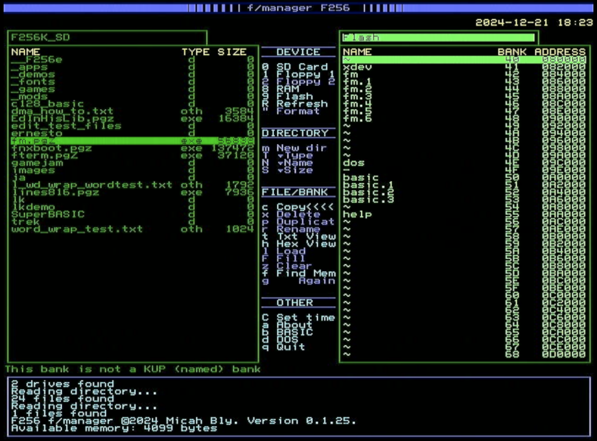

# f/manager F256

## Overview

f/manager is a dual-panel file and memory manager for the [Foenix F256jr and F256K retro computers](http://wiki.f256foenix.com/index.php?title=Main_Page). If you do not own a Foenix computer, or if you don't know what one is, this software should have limited interest for you. Go back now before you are sucked into the world of programming and using 8-bit and 16-bit computers as if it was the 1980s. You have been warned. 

If you are a brand new F256 owner, congratulations on your purchase, and welcome to exciting world of retro-computing... without retrobrite!

### Features

- View and sort the directory of your SD card, and up to 2 connected IEC devices (Commodore-format serial disk drives such as the 1541, 1571, 1581, FNX1591, or FNX1592). 
- Format floppy disks and SD cards
- Create subdirectories on SD cards
- Navigate through subdirectories
- Copy files from one place on a disk, to another place
- Copy files from one device to another
- Rename files
- Delete files
- View a file as text (including word-wrap)
- View a fix as hex
- Launch applications
- Launch files that have known helper applications - images, basic programs, mods, etc.
- View a "directory" of the RAM banks or flash memory banks of your computer
- Load a file from disk into a location in memory of your choosing
- Save a bank (8192 bytes) of memory to a file on disk
- Fill a bank of memory with a byte value you choose
- Find text strings and strings of hex digits in memory
- Set the real-time clock on your F256
- Shortcut to switch to DOS or SuperBASIC at any time

## User Guide

- [Installing the f/manager](documentation/installing.md)
- [Using the f/manager](documentation/using.md)
