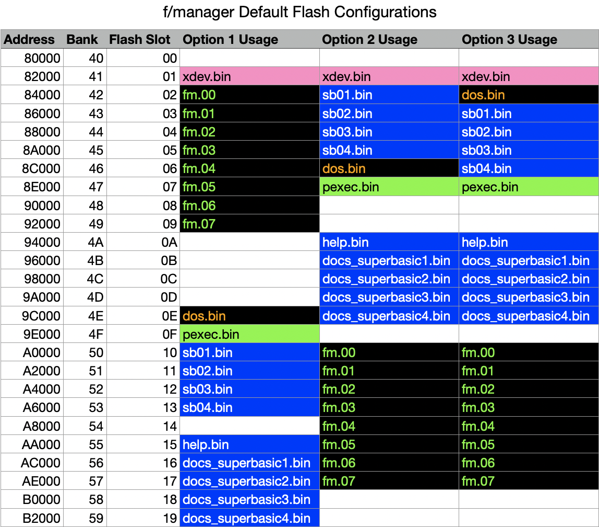

# Installation

## Before You Begin: Flash or Disk?

The f/manager can be run from flash, or from disk. If you know what you want to do, please proceed to the appropriate installation section below. If you aren't sure you want to run it from flash memory or disk, here are a few points to consider:

### About Running from Flash

- Running from flash involves doing a one-time upload (installation) of the program to flash memory
- Once in flash, the program will be instantly available when needed, simply by typing "fm" at a DOS prompt, or "/fm" in SuperBASIC.
- If you are impatient, installing to flash provides the quickest way to get into f/manager.
- If you are impatient and hate typing just to get into f/manager, you can _optionally_ have your Foenix startup directly in f/manager, rather than SuperBASIC or DOS.
	- The f/manager installation includes three pre-configured bulk upload schemes. You can, of course, configure your own. 
	
### About Running from Disk

- Running from disk involves copying the fm.pgZ file from the installation folder you downloaded, to your F256's SD card, or to a Commodore IEC-formatted floppy disk. The SD card will be significantly faster, of course. 
- Once you have copied the program to disk, starting it is very similar to running it from flash, you simply type "- fm" from DOS, or "/- fm" from SuperBASIC.
- f/manager will load in about 3-5 seconds from SD card, and 1-3 minutes from floppy. 

## Installing to SD Card or Floppy

1. On your Mac, Windows, or Linux computer, unzip the fm_install.zip folder if you have not already
1. Located the fm.pgZ file in the fm_install/disk folder.
1. Copy to disk. There are 4 main options:
	1. Use the [FoenixMgr](https://github.com/pweingar/FoenixMgr) program to copy it to your SD card. 
		1. Install the FoenixMgr if you have not already.
		1. cd into the fm_install/disk directory. e.g.: `cd mystuff/fm_install/disk`
		1. Run FoenixMgr with the "copy" command. e.g.: `python3 $FOENIXMGR/FoenixMgr/fnxmgr.py --copy fm.pgZ`
	1. Remove the SD Card from your F256, insert it into your modern computer, and copy the "fm.pgZ" file into the root of the SD card. You can put it somewhere else if you prefer. CAUTION: if you are planning to copy files back and forth between your F256 and other computers, I highly recommend you use the FoenixMgr. It will save wear and tear on the Foenix. If you don't want to use that approach, then consider getting a $10 SD card extension cable: it will also remove the wear and tear on your Foenix from ejecting and inserting the SD card over and over again. 
	1. If you have the WiFi option installed in your F256, you can use wget to transfer the file from your Mac/Windows/Linux computer. 
	1. If you have a Commodore computer and some method of transferring files to it (Ultimate 1541 II+, etc., etc.), you can transfer the "fm.pgZ" file to your Commodore, and save out to a floppy, then use that floppy on your F256. Obviously, this is the coolest way to do it. Equally obviously, you will need a physical floppy disk and IEC-compatible floppy disk drive hooked up to your F256. 
Running the f/manager from disk is very easy. The hardest part is getting the fm.pgZ file onto your SD card or IEC-formatted floppy disk ([1541](https://en.wikipedia.org/wiki/Commodore_1541), [1571](https://en.wikipedia.org/wiki/Commodore_1571), [1581](https://en.wikipedia.org/wiki/Commodore_1581), [FNX1591](https://c256foenix.com/accessories/?v=7516fd43adaa), [FNX1592](https://c256foenix.com/product/fnx1592hd/?v=7516fd43adaa), etc.). 

## Installing in Flash Memory

### Predecendence Considerations

You can install programs anywhere you in the flash memory of the F256, but the first (lowest bank) program is given a superpower: when the computer powers on or resets, this program is started automatically. In other words, if you want f/manager to be what you see when you turn on the computer, you'll want to install it in the first position. If you want the friendly blue SuperBASIC screen to be what you see, you'll need to install f/manager in some position after SuperBASIC (assuming some other program isn't already occupying a lower slot than SuperBASIC). 

Installing programs in flash is done via the [FoenixMgr](https://github.com/pweingar/FoenixMgr) program, with your modern computer connected to the USB debug port of your Foenix. While it is possible to use FoenixMgr to install the 8k chunks of a flash program one by one, this is neither necessary nor particularly fun. FoenixMgr provides a bulk upload facility, which reads simple [CSV](https://en.wikipedia.org/wiki/Comma-separated_values) files and uploads all the 8k data files for you. In your fm_install folder, you will find three pre-configured sets of CSV files. Choose the one that meets your needs, or create your own:

#### Flash Install Option 1: f/manager -> DOS -> SuperBASIC

Full Uploader: `option1_fm_dos_sb_full.csv`

Minimal Uploader: `option1_fm_dos_sb_min.csv`

Select this option if you want f/manager to be what greets you when you turn on or reset the Foenix. You can drop into SuperBASIC during or after startup by hitting the 'b' key.

#### Flash Install Option 2: SuperBASIC -> DOS -> f/manager

Full Uploader: `option2_sb_dos_fm_full.csv`

Minimal Uploader: `option2_sb_dos_fm_min.csv`

Select this option if you prefer to always start up in DOS. Select this if your Foenix is hooked up to an amber CRT or you wish it was. If you get tired of typing filenames, you can always type "fm" `<ENTER>` to jump into f/manager. You probably don't admit to your friends that you ever do this, but typing "basic" at the DOS prompt is also an option.

#### Flash Install Option 3: DOS -> f/manager -> SuperBASIC

Full Uploader: `option3_dos_fm_sb_full.csv`

Minimal Uploader: `option3_dos_fm_sb_min.csv`

Select this option if you want an honest-to-goodness retro computer that starts up in BASIC, as all good 8-bit computers should be capable of doing. If you need to move some files around or get tired of typing PEEK to see what's in memory you can type "/- fm" (the space after the '-' is important). 

#### Minimal vs Full Install

For each option above, 2 CSV files are provided. One will install (or re-install) the f/manager and the standard firmware of the F256. This is the full install version. You probably only need to use this if you decide you want to have f/manager in a different place in flash. Once you have installed f/manager, you can use the minimal install if need to install a newer version. The minimal install only uploads the specified binary data used by f/manager, plus the final bank of kernel code (all Foenix programs currently wipe out the final bank of Kernel when starting a flash upload, and then reinstall it at the end, to prevent issues where kernel tries to execute code in the middle of an upload). 

#### Flash Install Helper: Clean Me Up Scotty! (`clean_flash_deadbeef.csv`)

Reset to zeroes: `clean_flash_zeroes.csv`

Fill with $DE$AD$BE$EF: `clean_flash_deadbeef.csv`

These two files do not install anything. In fact, they remove everything but the Foenix MicroKernel, DOS, pexec, and the xdev low-level utility used by FoenixMgr to communicate with the F256. One file uploads all zeroes, the other uploads hex sequences of DEADBEEF. Why would you want to use these? You might never need to. But you might want to use one or the other if you have experimented with different flash programs, or have experimented with uploading programs to different locations. These files simply overwrite (almost) every block in flash and leave it in a predictable, sterile stage. To be clear: If you run one of these everything but the bare minimum needed to have a functioning Foenix will be cleared out. You can adjust it to wipe out even more, but if you do so, I hope you like [installing your programs by toggling mechanical switches](https://www.youtube.com/watch?v=7nDcTRqZu8E). 

### Installing

The installation procedure is simple:
1. Select your preferred install option (see above).
1. Copy all the files in the fm_install/flash folder to the folder with your firmware files in it. These are the files you got when you downloaded the [firmware package for the F256](https://github.com/FoenixRetro/f256-firmware).
1. Determine if you want/need to do a full install, or the minimal. The first time you install it, you'll want to do the full install. Every update after that, you'll just want to run the minimal updater. 
1. Run the following command in FoenixMgr:
	- `python3 $FOENIXMGR/FoenixMgr/fnxmgr.py --flash-bulk MY_PREFERRED_UPLOADER.csv`
		- Substitute the desired option uploader file name for **MY_PREFERRED_UPLOADER.csv**. 

[Back](_user_guide.md)