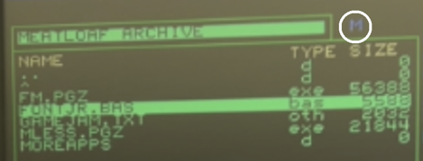

# Using f/manager

## Features

- View and sort the directory of your SD card, and up to 2 connected IEC devices (Commodore-format serial disk drives such as the 1541, 1571, 1581, FNX1591, FNX1592, or a networked Meatloaf). 
- Format floppy disks and SD cards
- Create subdirectories on SD cards
- Navigate through subdirectories
- Copy files from one place on a disk, to another place
- Copy files from one device to another
- Rename files
- Delete files
- View a file as text (including word-wrap)
- View a fix as hex
- Launch applications
- Launch files that have known helper applications - images, basic programs, mods, etc.
- View a "directory" of the RAM banks or flash memory banks of your computer
- Load a file from disk into a location in memory of your choosing
- Save a bank (8192 bytes) of memory to a file on disk
- Fill a bank of memory with a byte value you choose
- Find text strings and strings of hex digits in memory
- Set the real-time clock on your F256
- Shortcut to switch to DOS or SuperBASIC at any time

## Starting the f/manager

How you start up the f/manager depends on how you installed it in the first place, and what you are currently doing on the Foenix:
- If you installed it in flash, in the lowest position: turn on or reset your F256. f/manager will automatically start up. 
- If you installed it in flash, but not in the lowest position:
	- If you are in DOS, type "fm" and `<ENTER>`
	- If you are in SuperBASIC, type "/fm" and `<ENTER>`
	- If you are in some other program, say 3 Hail Marys, reset the computer, and hope it comes up in f/manager, DOS, or SuperBASIC. 
- If you did not install it on flash, and have it on disk:
	- If you are in DOS, type "- fm" and `<ENTER>`
	- If you are in SuperBASIC, type "/- fm" and `<ENTER>`
	- If you are in some other program, go outside, run around your house or apartment building 3 times _widdershins_ (very important), go back inside, reset the computer, and hope it comes up in f/manager, DOS, or SuperBASIC. 

## Getting Stuff Done with the f/manager

### Working with Devices
- [I want to work with a different device](#i-want-to-work-with-a-different-device)
- [I want to compare the contents of 2 devices](#i-want-to-compare-the-contents-of-2-devices)
- [I want to format a floppy disk](#i-want-to-format-a-floppy-disk)
- [I want to format an SD card](#i-want-to-format-an-sd-card)
- [I swapped floppies and want to see the listing for the new floppy](#i-swapped-floppies-and-want-to-see-the-listing-for-the-new-floppy)
- [I want to use my Meatloaf device](#i-want-to-use-my-meatloaf-device)

### Working with Meatloaf
- [I want to access the Foenix Meatloaf share](#i-want-to-access-the-foenix-meatloaf-share)
- [I want to access a Meatloaf directory by specifying the URL](#i-want-to-access-a-meatloaf-directory-by-specifying-the-url)
- [I want to load a Meatloaf file by specifying the URL](#i-want-to-load-a-meatloaf-file-by-specifying-the-url)
- [I want to load a file from the internet that I sent to Meatloaf](#i-want-to-load-a-file-from-the-internet-that-i-sent-to-meatloaf)
- [I want to copy a file from Meatloaf to my Foenix](#i-want-to-copy-a-file-from-meatloaf-to-my-foenix)
- [I want to copy a file from my Foenix to my Meatloaf](#i-want-to-copy-a-file-from-my-foenix-to-my-meatloaf)
- [I want to delete a file from a Meatloaf repository](#i-want-to-delete-a-file-from-a-meatloaf-repository)
- [I want to go back to my local (home) directory](#i-want-to-go-back-to-my-local-\(home\)-directory)

### Working with Directories
- [I want to create a new folder](#i-want-to-create-a-new-folder)
- [I want to delete a folder](#i-want-to-delete-a-folder)
- [I want to copy a folder and its contents](#i-want-to-copy-a-folder-and-its-contents)
- [I want to sort by file name, file size, or file type](#i-want-to-sort-by-file-name-file-size-or-file-type)

### Managing Files
- [I want to see what's on my SD Card or floppy disk](#i-want-to-see-whats-on-my-sd-card-or-floppy-disk)
- [I want to copy a file from one place in my SD card to another place](#i-want-to-copy-a-file-from-one-place-in-my-sd-card-to-another-place)
- [I want to copy a file from disk to another disk](#i-want-to-copy-a-file-from-disk-to-another-disk)
- [I want to delete a file](#i-want-to-delete-a-file)
- [I want to rename a file](#i-want-to-rename-a-file)
- [I want to view the contents of a file as text](#i-want-to-view-the-contents-of-a-file-as-text)
- [I want to view the contents of a file as hex data](#i-want-to-view-the-contents-of-a-file-as-hex-data)
- [I want to load a SuperBASIC program](#i-want-to-load-a-superbasic-program)
- more to come...

### Working with Memory
- documentation coming soon...

### Loading files and other applications
- documentation coming soon... in the meantime, if you select a .pgz or .pgx application, you can just hit ENTER or "l" to load it. f/manager will turn over the file to pexec, and it will fire it up for you. 
- [I want to load a music .mod file](#i-want-load-a-mod-file)
- [I want to load a different font](#i-want-load-a-different-font)

### Doing other Stuff
- [I want to set the system clock](#i-want-to-set-the-system-clock)
- [I want to get back to SuperBASIC](#i-want-to-get-back-to-superbasic)
- [I want to see who made this crappy tool](#i-want-to-see-who-made-this-crappy-tool)
- [Enough of this namby-pamby UI; I want to type DOS commands](#enough-of-this-namby-pamby-ui;-i-want-to-type-dos-commands)
- [I want to quit this app](#i-want-to-quit-this-app)

### Working with Devices

#### I want to work with a different device

On startup, f/manager will scan your system to determine how many disk systems you have attached. The list of devices in the center menu will indicate which devices were detected.

The F256 MicroKernel supports the SD card (Device 0), one or two IEC devices, as Device 1 and Device 2. Device 1 is an analog to Drive 8 on a Commodore system. In additional to Commodore 1541s, 1571s, 1581s, FNX1591s, etc., you can also connect the IEC-compatible network Meatloaf device. To switch to a different device, hit the number key that corresponds to the device # you want to work with. For example, hit '1' to switch to the first IEC device, and '0' to switch back to the SD card.

f/manager also supports working with the F256's RAM and Flash memory via the view panels. Select RAM with 8, and Flash with 9.

_Hint: Menu operations start from the current panel, which is the one that is not dimmed out. You can toggle back and forth between the left and right panels by hitting `<TAB>` (or select with the Right or Left cursor key)._

#### I want to compare the contents of 2 devices

The two-pane approach of the f/manager makes it easy. Hit Left cursor to select the left-hand panel if it is not already active. Use 0, 1, or 2 to select the first device you want to work with. The directory display will refresh. Hit `<TAB>` or Right cursor to select the right-hand panel. Use the number keys again to select the second device. The directory display will refresh. You are now seeing the listing for the first device on the left, and for the second device on the right. 

_Warning: Do not load the same IEC device on both panels unless you are prepared for unpredicable behavior. Very definitely do not expect to be able to load up one panel with a parent directory from an IEC device such as a 1581 or Meatloaf, and then the other panel with it again, but diving into a subdirectory. The IEC devices do not support paths in the same way the SD card does. The device only ever has ONE active directory.

#### I want to format a floppy disk

Before you can store programs on a new disk, you must first format the disk. To format a disk is to modify it so that the data on it is organized in the way your disk drive understands. When you format a disk, the drive will divide the disk into sections called tracks and sectors. You will give it a name, and a 2-letter unique ID code. A "directory", or table of contents, will be prepared. When you save a program to disk, the directory will be updated with the name of the program. 

_Note: While you can format a non-blank disk and use it, be aware that all data on it will be permanently lost when you do so. Typically, users only format a disk once, when using it the first time._

To format a floppy disk, have it in the drive, and make sure that you are on the panel that is pointing at the device representing the floppy (not the SD card!). Hit the '"' (straight double quote) key, and confirm that you want to format the disk. 

#### I want to format an SD card

To format the SD card, confirm you that the active panel is pointing to device 0, the SD card. Hit the '"' (straight double quote) key, and confirm that you want to format the SD card. 

#### I swapped floppies and want to see the listing for the new floppy

If you have made a change to the disk whose contents are being shown in the panel (by swapping in a new disk, for example), hit Shift-R to refresh the listing. 

#### I want to use my Meatloaf device

Well, what's stopping you? Plug it into the F256 and start it up. It will be recognized as Device 0 (if set to drive 8), or Device 1 (if set to Drive 9). The F256 MicroKernel does not currently recognize more than 2 IEC devices, so if you have it set to 10 or 11, it will not be seen. 

When the f/manager detects a Meatloaf device, an "M" character will be shown to the right of the disk title. This signifies that the f/manager is in "Meatloaf mode", and it will apply special handling. See the Meatloaf section below for more information.

### Working with Meatloaf

#### I want to access the Foenix Meatloaf share

From a panel that is in Meatloaf mode, hit shift-M. A dialog box will open, asking which URL you want to go to. The address of the Foenix Meatloaf share will be prepopulated, so all you need to do is hit `<ENTER>`. You will be taken to the curated Foenix share managed by EMWhite. From here, you can download apps, utilities, and other files known to work with the current configuration of the F256 (classic). 

#### I want to access a Meatloaf directory by specifying the URL

From a panel that is in Meatloaf mode, hit shift-M. A dialog box will open, asking which URL you want to go to. The address of the Foenix Meatloaf share will be prepopulated. Delete it and type in the URL that you want to access, then hit `<ENTER>`.

_Note: This is a change directory action, not a load file action, so do not type in the URL of a file. Use the URL to the parent folder of the file. After the directory is loaded, you can decide if you want to copy the file, run it, view it, etc._

#### I want to load a Meatloaf file by specifying the URL

This action is not currently supported. Instead, use the shift-M command and specify the address of the parent directory, then select the file you want to work with and choose the appropriate action. 

#### I want to load a file from the internet that I sent to Meatloaf

This action is not currently supported. Instead, use the shift-M command and specify the address of the parent directory, then select the file you want to work with and choose the appropriate action. 

#### I want to copy a file from Meatloaf to my Foenix

Open a Meatloaf directory containing the file you want to copy in one panel, and open the destination SD card or floppy in the second panel. Make sure the Meatloaf panel is the active panel (use `<TAB>` to switch panels if necessary). Hit `c` to start the copy procedure.

#### I want to copy a file from my Foenix to my Meatloaf

This action is not currently supported, as Meatloaf remote directories are read-only and cannot be modified.

#### I want to delete a file from a Meatloaf repository

This action is not currently supported, as Meatloaf remote directories are read-only and cannot be modified.

#### I want to go back to my local (home) directory

In the current panel's directory listing, locate the file that shows as `^`. Hit `<ENTER>`. Your local directory for your Meatloaf device will be reloaded.

### Working with Directories

#### I want to create a new folder

Hit 'm' to create a new folder (mkdir).

#### I want to delete a folder

Select the folder you want to delete, and hit 'x' or `<DELETE>`... is how it should work, but due to an undocumented feature in the MicroKernel, it is not currently possible to delete folders.

#### I want to copy a folder and its contents

f/manage does not support a "copy folder" function, but you can do it fairly easily, thanks to the 2-pane approach. Load the directory with the source in one pane, and the directory that you want to copy to in the other pane. Use 'm' to create a new folder in the destination directory. Select the new folder and hit `<ENTER>` to navigate into it. Tab back to the source panel, and enter the folder with the files to copy. Select each file in turn, using 'c' to copy to the other pane. 

#### I want to sort by file name, file size, or file type

By default, f/manager sorts directories by file name. You can rotate between the different sort types with the following keys:
- shift-t: sort by file type
- shift-s: sort by file size
- shift-n: sort by file name

A small arrow symbol is shown next to the header for the column that controls the sort.

### Managing Files

#### I want to see what's on my SD Card or floppy disk

On startup, f/manager will scan your system to determine how many disk systems you have attached. Being a Foenix MicroKernel-based program, it can support device 0, the SD Card, as well as Devices 1 and 2, which are reserved for IEC devices such as floppy drives. As long as you have your SD card installed (and it is compatible), the left-hand panel will already be displaying the contents of it. If no SD card was installed, but you have 1 or floppy drives connected, f/manager will show you the contents of the floppies instead. If you have no SD card and no floppies installed, f/manager will instead show you a list of the memory banks in your computer. 

#### I want to copy a file from one place in my SD card to another place

f/manager is a classic two-pane file manager. It will let you copy from either the left pane or the right pane, provided the opposite pane is representing a write-capable device. You can copy from flash memory to disk, for example, but you cannot copy from disk or RAM to flash. Not without reconfiguring the main deflector dish, at least. You can select the same device in both panes. This is allowed and normal, and it is in fact the easiest way to copy a file from one directory to another. Let's take an example where we care copying a file from the SD card's root directory, to a subdirectory called "Games". With the left pane activated (the active pane is the bright green one, the inactive pane is the faded one), hit '0' to show the contents of the SD card's root directory, if it is not already showing. Hit the `<TAB>` key to switch focus to the right-hand pane. Do the same thing here: hit '0' to see the root folder of the SD card. Now use the up and down cursor keys to navigate to the folder you want to copy a file to ("Games" in our example). Enter the folder by hitting, you guessed it: `<ENTER>`. The pane will reload, showing the contents of the directory you selected. Now hit the left cursor key to make the left pane the active pane again. You could also have used `<TAB>` which toggles between left and right. Use the up and down cursor keys to highlight the file you want to copy. When you have it selected, hit 'c' to start the copy operation.  

#### I want to copy a file from disk to another disk

Easy-peasy, lemon-squeezy. Use the '0','1', and/or '2' keys to get the source and destination disks showing in the left and right panes. It doesn't matter which is at left or right. Once you have that set up, make sure the source disk pane is active (bright green). Use `<TAB>` or left/right cursor keys if necessary. Now hit the 'c' button. The Copy menu item shows a series of arrows ('<<<<' or '>>>>') to help you understand which way it will copy when you hit 'c'. That's it. The progress bar will let you know when the copy is complete. File copy is pretty fast on an SD card, but if  you were copy a large file, say "fm.pgZ" from the SD card to a floppy in a 1541 drive, well, that would give you an idea of what computing was like in the 1980s. 

#### I want to delete a file

Select the file you want to delete, and use `<DELETE>` or `x`, then confirm you want to delete the file. 

#### I want to rename a file

Select the file you want to rename, hit `r`, then type in the new name for the file.

#### I want to view the contents of a file as text

Select the file you want to view, and hit `t`. The entire file will be loaded into extended memory, and then displayed one screen at a time. Embedded line breaks are respected, and word wrapping will be used when necessary. Hit `<SPACE>` to display the next page, or `<RUN/STOP>` to exit the text viewer and return to the main screen. 

!Text View Example(view_text.png)

#### I want to view the contents of a file as hex data

Select the file you want to view, and hit `h`. The entire file will be loaded into extended memory, and then displayed one screen at a time. Each byte in the file will be displayed first in hex, then as raw character data to the right. Hit `<SPACE>` to display the next page, or `<RUN/STOP>` to exit the hex viewer and return to the main screen. 

!Hex View Example(view_hex.png)

#### I want to load a SuperBASIC program

Select the BASIC program file you want to load, and hit `<ENTER>` or `<l>`. f/manager will load it into extended memory at 0x28000, display a reminder to type `xgo` when you get to SuperBASIC, and wait for you to hit a key. It will then call up SuperBASIC from flash. At the SuperBASIC prompt, type the xgo command and hit `<ENTER>`. That tells SuperBASIC that it should load in the data it will find at 0x28000 as if it was a program, and do `RUN`.

### Working with Memory

- documentation coming soon...

### Loading files and other applications

- documentation coming soon... in the meantime, if you select a .pgz or .pgx application, you can just hit ENTER or "l" to load it. f/manager will turn over the file to pexec, and it will fire it up for you. 

#### I want to load a music .mod file

Navigate to the file you want to load. It doesn't matter what device or folder it is in. Load it by hitting ENTER or 'l'. f/manager will ask pexec to load the ModoJR music player, and give it the path to the .mod file you selected. 

_Hint: You must have ModoJR or another file capable of playing .mod files and also aware of Foenix parameter passing conventions installed at 0:\_apps/modo.pgz_

#### I want to load a different font

Navigate to the font file you want to load. For example, if you keep your fonts on the SD card at 0:_fonts/, navigate to that folder. Select the font you want to load, and hit `<ENTER>` or `<l>`. The font will be loaded into the secondary font bank and be displayed immediately. 

### Doing other Stuff

#### I want to set the system clock

Did you notice that yellow clock at the top right of your f/manager screen? If you have never set your clock before, it's probably showing the wrong time. Or maybe a bit of code ran wild and overwrote VICKY registers. Let's get your clock set again. Type 'C'. A dialog will open. 

Enter the date using the format shown. For example, to set it to April 1, 2024, 6:08 pm, you would enter "24-04-01 18:08". The seconds are always reset to 0. When I was a kid computers couldn't afford seconds. Deal with it. [What's with the weird year>month>day thing, you ask? Here you go.](https://imgs.xkcd.com/comics/iso_8601.png)

#### I want to get back to SuperBASIC

Hit 'b' from the main screen to switch to SuperBASIC. This assumes, of course, that you have SuperBASIC loaded into flash memory (which all F256s do by default).

#### I want to see who made this crappy tool

Hit 'a' to see some information about f/manager, including the version number.

#### Enough of this namby-pamby UI; I want to type DOS commands

Hit 'd' from the main screen to switch to DOS. This assumes, of course, that you have DOS loaded into flash memory (which all F256s do by default).

#### I want to quit this app

Hit 'q' from the main screen to quit the f/manager. The computer will get a soft reset, and whatever you have first in flash memory will start up again. If your configuration defaults to SuperBASIC on startup, for example, you will see the SuperBASIC screen.

_Hint: If your configuration defaults to starting up with f/manager, quitting won't achieve much, I'm afraid. _

[Top](using.md)

[Back](_user_guide.md)